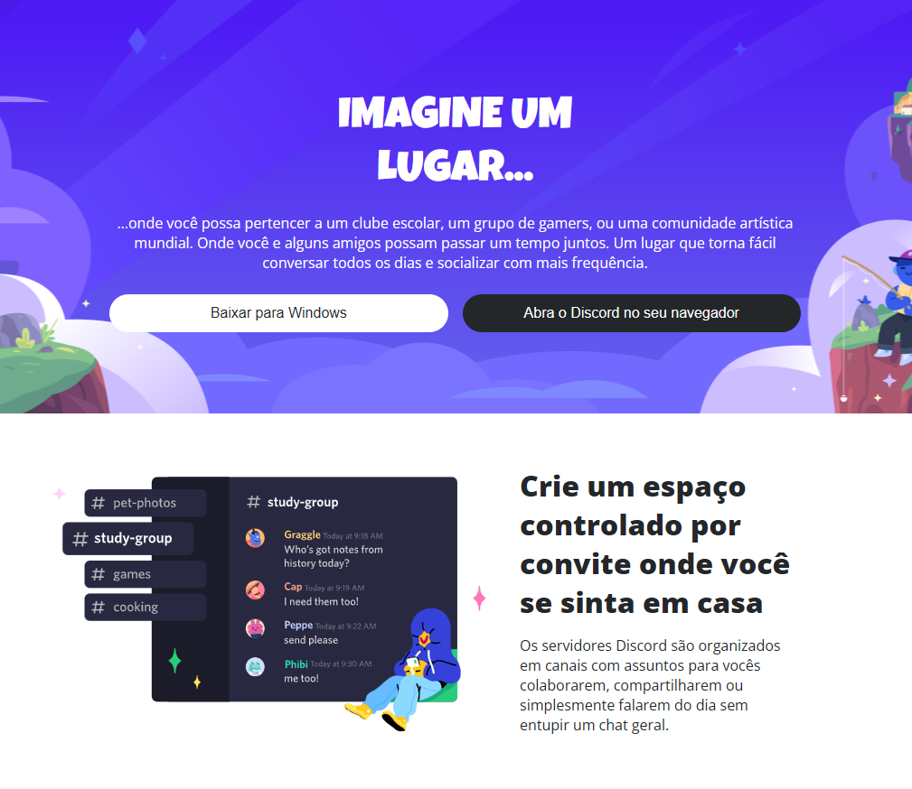

# Projeto Layout Responsivo Para o Site do Discord

>Michele Ambrosio

O objetivo geral deste modulo 2 é mostrar os conceitos de responsividade e ensinar as técnicas que podemos utilizar para deixarmos nosso site responsivo, juntamente com os cursos de posicionamentos e Displays com CSS, Flexbox e Grid Layout.

```
* Layouts Flexíveis (Multicol, Flexbox, Grid)
* Meta tag viewport
* Media Queries(Tipos, Features, Operadores logicos, Breakpoints)
* Imagens e tipografias responsivas
* Mobile First
```

## Tecnologias Utilizadas

* HTML
* CSS

## Estrutura do Projeto

```shell
   tree
  ./6º Projeto-Layout Responsivo com Discord/
  ├── assets/
  |   └── icons/
  │   └── images/
  |   └── responsive.css
  │   └── style.css
  ├── index.html
  ├── README.md
  
```

## Media Queries

### Exemplo

```css
 /* iPhone 14 Pro Max */
@media screen and (min-width: 325px) {}

/* iPad mini */
@media screen and (min-width: 1768px) {}

/* Home Page Desktop */
@media screen and (min-width: 1140px) {} 
```

## Conclusão

Este é um projeto que foi desenvolvido seguindo os principios de responsividade `first mobile`, garantindo uma experiência perfeita em diferentes dispositivos e tamanhos de tela.

### Projeto Concluído

>[Clique Aqui e confira!](https://luizfcs35.github.io/Desafio.CSS-Layout.Responsivo.Discord/)

<p align="center">
  
  
</p>

